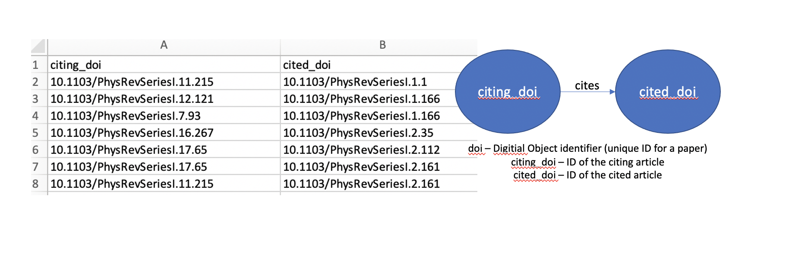
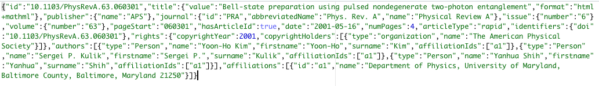

# Data sources

We analyze citation data about Physical Review Journal articles published by the American Physical Society (APS). APS has made available to researchers data based on their publications for use in research about networks and the social aspects of science.  

Physical Review Journals are divided into various categories based on the field of physics and type of articles published in the journals. More detail can be found here - https://journals.aps.org/about  

Here is a brief overview of the categories - 

* PRL (Physical Review Letters) – weekly coverage of major advances in physics and cross-disciplinary developments

* PRX (Physical Review X) – online-only, open access, peer-reviewed. Publishes exceptional original research papers from all areas of pure,applied and interdisciplinary physics.

* PRA (Physical Review A) – atomic, molecular, and optical physics and quantum information

* PRB (Physical Review B) – condensed matter and material physics

* PRAB – Physical Review Accelerator and Beams

* PRC (Physical Review C) – Nuclear Physics

* PRD (Physical Review D) – particles, fields, gravitation, and cosmology

* PRE – statistical, nonlinear, biological, and soft matter physics

* PRApplied – all aspects of experimental and theoretical applications of physics

* PRFluids – online-only, fundamental understanding of fluids

* PRMaterials – research on materials

* PRPER - Physics Education Research

* PRRESEARCH – all research topics of interest to the physics community

* PRSTAB

* PRSTPER

* RMP – Reviews of Modern Physics – indepth review articles


The datasource is not publicly available for download. We requested access to it by filling out a web inquiry form, and data was made available to us for download in the form of downloadable links.  

Below is a description of our data source from the APS data set website - https://journals.aps.org/datasets  
The data source has information about more than 450,000 (656,622 to be exact) articles spanning the period between 1893 and 2019.  Two data sets that were made available to us, and that we have worked with are as follows -

1) Citing article pairs: This data set consists of pairs of APS articles that cite each other. For instance, if article A cites article B, there will be an entry in the data set consisting of the pair of DOIs for A and B. This data set is formatted as a comma-separated values (CSV) file consisting of the DOI pairs, one pair per line.  
Note that this data only consists of APS articles that cite other APS articles. There could be articles that they cite outside of APS, but we do not have the data for it in our dataset. So the citations given and citations received will be a lower bound of the actual numbers.  


```{r echo = FALSE, out.width='100%'}


```

2) Article metadata: This data set consists of the basic metadata of all APS journal articles. This data is in json format, one json file for each article. The metadata provided includes the following fields: DOI, journal, volume, issue, first page and last page OR article id and number of pages, title, authors, affiliations, publication history, PACS codes, table of contents heading, article type, and copyright information.  

```{r echo = FALSE, out.width='100%'}

```


