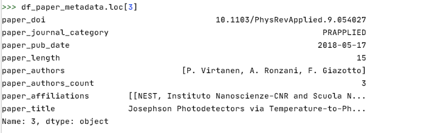

# Data transformation

Data clean up and transformation was the most challenging part of our project, given the complex nature and size of the data set. We provide a summary here. There are additional steps we have performed that we have excluded here for conciseness. We can provide details if required. We have the complete code of our transformation in python and R in our repository.  

Transformation in Python: 
The bulk of the data cleanup and transformation of our raw metadata was done using Python. The code is in our repository here - https://github.com/superpowergirl/PR_citations/tree/main/datatransformation_python  
Below is a brief of how we transform the json metadata into a dataframe in python. We then converted this dataframe into a comma separated values (csv) file and imported them into R for further cleanup and transformation as applicable for our analysis.  


Each article has a corresponding json file that has its metadata. We parse through all the json files in python and generate a dataframe with the relevant columns we would need for analysis. We have 656622 such articles, and hence our final dataframe has 656622 rows - one for each article.  
As an example, let us look at one row of the dataframe corresponding to one article. Please refer to the Data Sources section for a representation of the metadata json file for a particular article.

```{r echo = FALSE, out.width='100%'}


```  

While generating this dataframe, we ensure that we take care of the following - we filter out the 'author type' that is not 'Person' because there are instances where a survey group organization might be an 'author'. We match the affiliation Ids of authors to the names corresponding to those Ids and add them in the paper_affiliations column.  

Clean up and Transformation in R:  
The above was an initial transformation that we did in Python.After we ingest the the citation pairs csv (provided as a data set) and the two generated metadata csvs from python above, we do some further clean up to remove any missing values. These 3 dataframes form the basis for performing all our analysis, by combining different columns from them and doing calculations on them to generate more dataframes that were used to create visualizations. We provide the code related to these specific transformations within the results section.


